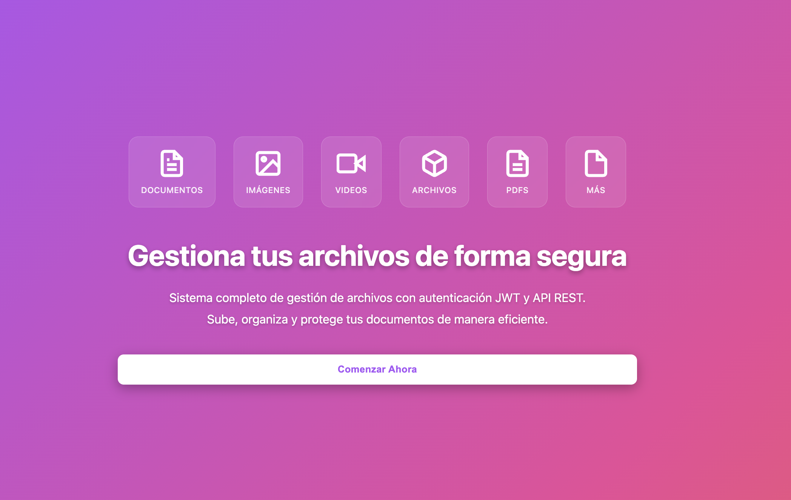
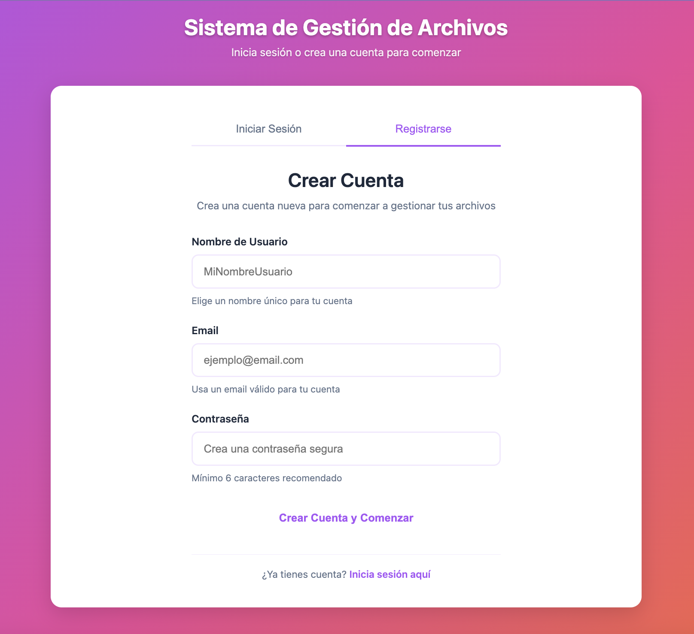
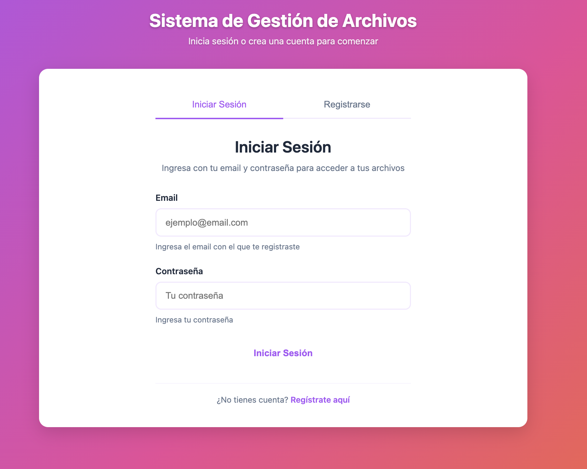
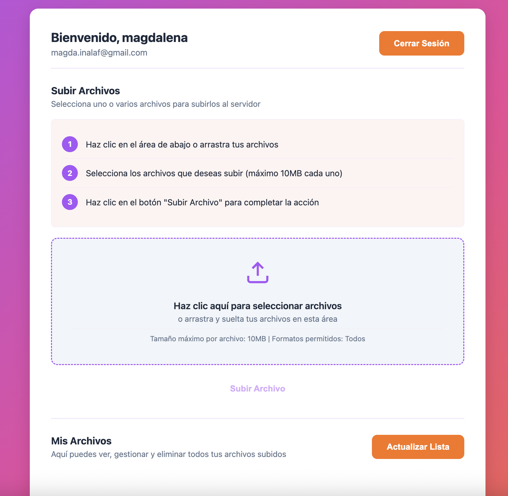
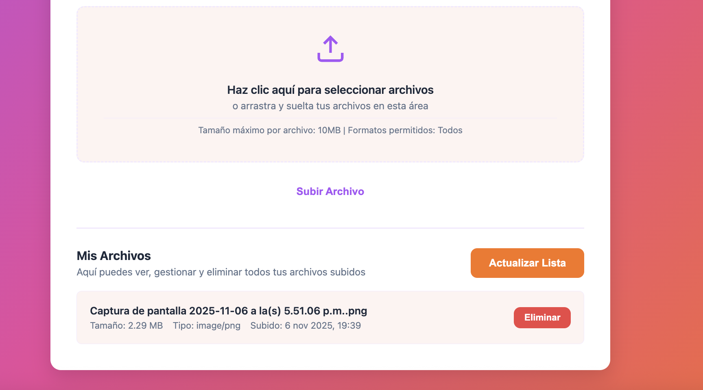

# API REST - Gestión de Archivos con Autenticación JWT

API REST desarrollada con Node.js y Express que permite la gestión de archivos y servicios de autenticación utilizando JSON Web Tokens (JWT). Incluye un frontend moderno e intuitivo para interactuar con la API.

## Autor

**Magdalena Inalaf**

- GitHub: https://github.com/MagdaIG
- LinkedIn: https://www.linkedin.com/in/minalaf/
- Página web: https://inalaf.ca/
- Email: magda.inalaf@gmail.com

## Características

- API RESTful siguiendo buenas prácticas
- Autenticación y autorización con JWT
- Registro y login de usuarios
- Actualización de perfil de usuario (PUT)
- Eliminación de cuenta de usuario (DELETE)
- Sistema de avatares:
  - Selección de avatares predeterminados
  - Subida de avatar personalizado
  - Eliminación de avatar
- Subida de archivos con validación de tamaño y tipo
- Listado y eliminación de archivos
- Frontend moderno e intuitivo
- Protección de rutas con middleware JWT
- Manejo de errores y respuestas consistentes
- Código modularizado siguiendo el patrón MVC (Modelo-Vista-Controlador)

## Tecnologías Utilizadas

- Node.js
- Express.js
- JSON Web Tokens (JWT)
- express-fileupload
- dotenv
- HTML5, CSS3, JavaScript (Vanilla)

## Requisitos Previos

- Node.js (versión 14 o superior)
- npm (versión 6 o superior)

## Instalación

1. Clona o descarga el repositorio en tu máquina local.

2. Abre una terminal en el directorio del proyecto.

3. Instala las dependencias ejecutando el siguiente comando:

```bash
npm install
```

Este comando instalará todas las dependencias necesarias:
- express
- express-fileupload
- jsonwebtoken
- dotenv

## Configuración

1. Crea un archivo `.env` en la raíz del proyecto con las siguientes variables de entorno:

```
PORT=3000
JWT_SECRET=tu_secreto_jwt_muy_seguro_cambiar_en_produccion
UPLOAD_DIR=./uploads
MAX_FILE_SIZE=10485760
```

**Importante**: 
- El archivo `.env` no está incluido en el repositorio por razones de seguridad (está en `.gitignore`).
- Debes crear este archivo manualmente antes de ejecutar la aplicación.
- En un entorno de producción, debes cambiar el valor de `JWT_SECRET` por una cadena segura y aleatoria. Puedes generar uno usando:
  ```bash
  node -e "console.log(require('crypto').randomBytes(32).toString('hex'))"
  ```

2. Los directorios `uploads` y `public/avatars` se crearán automáticamente cuando ejecutes la aplicación por primera vez.

## Ejecución

Para iniciar el servidor, ejecuta el siguiente comando en la terminal:

```bash
npm start
```

O también puedes usar:

```bash
node app.js
```

El servidor se iniciará en `http://localhost:3000` (o en el puerto que hayas configurado en el archivo `.env`).

## Uso de la Aplicación

### Acceso al Frontend

Una vez que el servidor esté corriendo, abre tu navegador web y visita:

```
http://localhost:3000
```

### Pasos para Usar la Aplicación

1. **Registro de Usuario**:
   - En la interfaz web, haz clic en la pestaña "Registrarse"
   - Completa el formulario con:
     - Nombre de usuario
     - Email
     - Contraseña
   - Haz clic en "Registrarse"
   - Se generará automáticamente un token JWT y serás redirigido a la sección principal

2. **Iniciar Sesión**:
   - Si ya tienes una cuenta, haz clic en la pestaña "Iniciar Sesión"
   - Ingresa tu email y contraseña
   - Haz clic en "Iniciar Sesión"
   - Serás autenticado y redirigido a la sección principal

3. **Subir Archivos**:
   - Una vez autenticado, verás la sección de subida de archivos
   - Puedes subir archivos de dos formas:
     - Haciendo clic en el área de subida y seleccionando archivos
     - Arrastrando y soltando archivos en el área de subida
   - Selecciona uno o más archivos (tamaño máximo: 10MB por archivo)
   - Haz clic en "Subir Archivo"
   - Los archivos se guardarán en el servidor

4. **Ver Archivos**:
   - En la sección "Mis Archivos" verás todos los archivos que has subido
   - Cada archivo muestra:
     - Nombre original
     - Tamaño
     - Tipo MIME
     - Fecha de subida

5. **Eliminar Archivos**:
   - En la lista de archivos, haz clic en el botón "Eliminar" del archivo que deseas borrar
   - Confirma la eliminación
   - El archivo será eliminado del servidor

6. **Gestionar Avatar**:
   - Haz clic en el icono de edición sobre tu avatar
   - Puedes seleccionar un avatar predeterminado de la galería
   - O subir una imagen personalizada (máximo 2MB, formatos: JPEG, PNG, GIF, WEBP)
   - También puedes eliminar tu avatar actual

7. **Editar Perfil**:
   - Haz clic en el botón "Editar Perfil"
   - Actualiza tu nombre de usuario, email o contraseña
   - Los campos que dejes en blanco no se modificarán

8. **Eliminar Cuenta**:
   - Haz clic en el botón "Eliminar Cuenta"
   - Confirma la eliminación en el modal
   - Se eliminarán todos tus datos, archivos y avatares

9. **Cerrar Sesión**:
   - Haz clic en el botón "Cerrar Sesión" en la parte superior
   - Serás redirigido a la pantalla de login

## Capturas de Pantalla

A continuación se muestran las diferentes secciones de la aplicación:

### Página de Inicio

La página de inicio presenta una interfaz moderna con iconos que representan los diferentes tipos de archivos que puedes gestionar (documentos, imágenes, videos, PDFs, etc.).



*La página de inicio muestra iconos profesionales de diferentes tipos de archivos y un botón para comenzar a usar la aplicación.*

### Registro de Usuario

Formulario para crear una nueva cuenta en el sistema. Incluye validación de campos y mensajes de ayuda.



*Formulario de registro con campos para nombre de usuario, email y contraseña. Incluye enlaces para cambiar entre registro e inicio de sesión.*

### Inicio de Sesión

Página de autenticación para usuarios existentes. Permite acceder a la cuenta con email y contraseña.



*Formulario de inicio de sesión con validación y mensajes de ayuda. Incluye opción para registrarse si no tienes cuenta.*

### Subir Archivos

Interfaz intuitiva para subir archivos mediante arrastrar y soltar o selección directa. Muestra instrucciones paso a paso.



*Área de subida de archivos con instrucciones claras. Permite subir múltiples archivos a la vez con validación de tamaño.*

### Archivo Subido

Vista de los archivos subidos con información detallada y opción para eliminarlos.



*Lista de archivos subidos mostrando nombre, tamaño, tipo y fecha. Incluye botón para eliminar cada archivo.*

## Endpoints de la API

### Autenticación

#### POST /api/users/register
Registra un nuevo usuario.

**Body (JSON)**:
```json
{
  "username": "nombre_usuario",
  "email": "usuario@email.com",
  "password": "contraseña"
}
```

**Respuesta exitosa (201)**:
```json
{
  "success": true,
  "message": "Usuario registrado exitosamente",
  "token": "jwt_token_aqui",
  "user": {
    "id": 1,
    "username": "nombre_usuario",
    "email": "usuario@email.com"
  }
}
```

#### POST /api/users/login
Inicia sesión con un usuario existente.

**Body (JSON)**:
```json
{
  "email": "usuario@email.com",
  "password": "contraseña"
}
```

**Respuesta exitosa (200)**:
```json
{
  "success": true,
  "message": "Login exitoso",
  "token": "jwt_token_aqui",
  "user": {
    "id": 1,
    "username": "nombre_usuario",
    "email": "usuario@email.com"
  }
}
```

#### GET /api/users/profile
Obtiene el perfil del usuario autenticado.

**Headers**:
```
Authorization: Bearer jwt_token_aqui
```

**Respuesta exitosa (200)**:
```json
{
  "success": true,
  "user": {
    "id": 1,
    "username": "nombre_usuario",
    "email": "usuario@email.com",
    "createdAt": "2024-01-01T00:00:00.000Z"
  }
}
```

#### PUT /api/users/profile
Actualiza el perfil del usuario autenticado.

**Headers**:
```
Authorization: Bearer jwt_token_aqui
Content-Type: application/json
```

**Body (JSON)** - Puedes actualizar uno o más campos:
```json
{
  "username": "nuevo_nombre_usuario",
  "email": "nuevo@email.com",
  "password": "nueva_contraseña"
}
```

**Respuesta exitosa (200)**:
```json
{
  "success": true,
  "message": "Perfil actualizado exitosamente",
  "user": {
    "id": 1,
    "username": "nuevo_nombre_usuario",
    "email": "nuevo@email.com",
    "avatar": "/avatars/defaults/avatar1.svg",
    "createdAt": "2024-01-01T00:00:00.000Z",
    "updatedAt": "2024-01-02T00:00:00.000Z"
  }
}
```

#### DELETE /api/users/profile
Elimina la cuenta del usuario autenticado. Esta acción es permanente.

**Headers**:
```
Authorization: Bearer jwt_token_aqui
```

**Respuesta exitosa (200)**:
```json
{
  "success": true,
  "message": "Usuario eliminado exitosamente"
}
```

### Gestión de Avatares

#### GET /api/users/avatars/defaults
Obtiene la lista de avatares predeterminados disponibles.

**Headers**:
```
Authorization: Bearer jwt_token_aqui
```

**Respuesta exitosa (200)**:
```json
{
  "success": true,
  "avatars": [
    {
      "id": "avatar1",
      "url": "/avatars/defaults/avatar1.svg",
      "name": "avatar1.svg"
    }
  ]
}
```

#### POST /api/users/avatar/upload
Sube un avatar personalizado. Requiere autenticación.

**Headers**:
```
Authorization: Bearer jwt_token_aqui
```

**Body (FormData)**:
```
avatar: [archivo_imagen]
```

**Respuesta exitosa (200)**:
```json
{
  "success": true,
  "message": "Avatar subido exitosamente",
  "avatar": "/avatars/users/user_1_1234567890.jpg",
  "user": {
    "id": 1,
    "username": "nombre_usuario",
    "email": "usuario@email.com",
    "avatar": "/avatars/users/user_1_1234567890.jpg"
  }
}
```

#### POST /api/users/avatar/select
Selecciona un avatar predeterminado. Requiere autenticación.

**Headers**:
```
Authorization: Bearer jwt_token_aqui
Content-Type: application/json
```

**Body (JSON)**:
```json
{
  "avatarId": "avatar1"
}
```

**Respuesta exitosa (200)**:
```json
{
  "success": true,
  "message": "Avatar seleccionado exitosamente",
  "avatar": "/avatars/defaults/avatar1.svg",
  "user": {
    "id": 1,
    "username": "nombre_usuario",
    "email": "usuario@email.com",
    "avatar": "/avatars/defaults/avatar1.svg"
  }
}
```

#### DELETE /api/users/avatar
Elimina el avatar actual del usuario. Requiere autenticación.

**Headers**:
```
Authorization: Bearer jwt_token_aqui
```

**Respuesta exitosa (200)**:
```json
{
  "success": true,
  "message": "Avatar eliminado exitosamente",
  "user": {
    "id": 1,
    "username": "nombre_usuario",
    "email": "usuario@email.com",
    "avatar": null
  }
}
```

### Gestión de Archivos

#### POST /api/files/upload
Sube un archivo al servidor. Requiere autenticación.

**Headers**:
```
Authorization: Bearer jwt_token_aqui
```

**Body (FormData)**:
```
file: [archivo]
```

**Respuesta exitosa (201)**:
```json
{
  "success": true,
  "message": "Archivo subido exitosamente",
  "file": {
    "id": 1,
    "originalName": "documento.pdf",
    "fileName": "1234567890-abc123.pdf",
    "size": 1024,
    "mimetype": "application/pdf",
    "uploadedAt": "2024-01-01T00:00:00.000Z"
  }
}
```

#### GET /api/files
Obtiene la lista de archivos del usuario autenticado.

**Headers**:
```
Authorization: Bearer jwt_token_aqui
```

**Respuesta exitosa (200)**:
```json
{
  "success": true,
  "count": 2,
  "files": [
    {
      "id": 1,
      "originalName": "documento.pdf",
      "fileName": "1234567890-abc123.pdf",
      "size": 1024,
      "mimetype": "application/pdf",
      "uploadedAt": "2024-01-01T00:00:00.000Z"
    }
  ]
}
```

#### GET /api/files/:id
Obtiene información de un archivo específico. Requiere autenticación.

**Headers**:
```
Authorization: Bearer jwt_token_aqui
```

**Respuesta exitosa (200)**:
```json
{
  "success": true,
  "file": {
    "id": 1,
    "originalName": "documento.pdf",
    "fileName": "1234567890-abc123.pdf",
    "size": 1024,
    "mimetype": "application/pdf",
    "uploadedAt": "2024-01-01T00:00:00.000Z"
  }
}
```

#### DELETE /api/files/:id
Elimina un archivo del servidor. Requiere autenticación.

**Headers**:
```
Authorization: Bearer jwt_token_aqui
```

**Respuesta exitosa (200)**:
```json
{
  "success": true,
  "message": "Archivo eliminado exitosamente"
}
```

## Códigos de Estado HTTP

La API utiliza los siguientes códigos de estado HTTP:

- 200: Solicitud exitosa
- 201: Recurso creado exitosamente
- 400: Solicitud incorrecta (datos faltantes o inválidos)
- 401: No autenticado (token faltante o inválido)
- 403: Token inválido o expirado
- 404: Recurso no encontrado
- 500: Error interno del servidor

## Estructura del Proyecto

```
gestion-archivo-v2/
├── app.js                 # Servidor Express principal
├── package.json           # Dependencias y scripts del proyecto
├── .env                   # Variables de entorno (debes crearlo manualmente)
├── .gitignore            # Archivos a ignorar en Git
├── README.md             # Este archivo
├── controllers/          # Controladores (lógica de negocio)
│   ├── userController.js # Controlador de usuarios
│   └── fileController.js # Controlador de archivos
├── routes/               # Rutas de la API
│   ├── userRoutes.js     # Rutas de usuarios
│   └── fileRoutes.js     # Rutas de archivos
├── models/               # Modelos de datos
│   ├── user.js           # Modelo de usuario
│   └── file.js           # Modelo de archivo
├── middleware/           # Middleware personalizado
│   └── auth.js           # Middleware de autenticación JWT
├── uploads/              # Directorio donde se guardan los archivos (se crea automáticamente)
├── public/                # Archivos estáticos del frontend
│   ├── index.html        # Página principal
│   ├── styles.css        # Estilos CSS
│   ├── app.js            # Lógica del frontend
│   └── avatars/          # Directorio de avatares (se crea automáticamente)
│       ├── defaults/     # Avatares predeterminados
│       └── users/        # Avatares personalizados de usuarios
├── docs/                 # Documentación
│   ├── images/           # Capturas de pantalla
│   ├── postman-collection.json  # Colección de Postman
│   └── PRUEBAS_POSTMAN.md # Guía de pruebas con Postman
```

## Seguridad

- Las contraseñas se almacenan en texto plano en esta versión de desarrollo. En producción, deben ser hasheadas usando bcrypt o similar.
- Los tokens JWT tienen una expiración de 24 horas.
- Las rutas protegidas requieren un token JWT válido en el header Authorization.
- El tamaño máximo de archivo es configurable (por defecto 10MB).
- Los archivos se almacenan con nombres únicos para evitar conflictos.

## Arquitectura del Proyecto

El proyecto sigue una arquitectura modular siguiendo buenas prácticas de desarrollo:

- **Modelos**: Contienen la estructura de datos y métodos para interactuar con ellos (models/user.js, models/file.js).
- **Controladores**: Contienen la lógica de negocio y manejan las peticiones HTTP (controllers/userController.js, controllers/fileController.js).
- **Rutas**: Definen los endpoints de la API y conectan las rutas con los controladores (routes/userRoutes.js, routes/fileRoutes.js).
- **Middleware**: Funciones intermedias como la autenticación JWT (middleware/auth.js).
- **Servidor Principal**: app.js configura Express y conecta todos los módulos.

Esta estructura facilita el mantenimiento, la escalabilidad y el testing del código.

## Notas de Desarrollo

- Esta aplicación utiliza almacenamiento en memoria para usuarios y metadatos de archivos. En producción, se debe implementar una base de datos real (MongoDB, PostgreSQL, etc.).
- Los archivos se guardan físicamente en el directorio `uploads/`.
- El frontend se sirve como archivos estáticos desde el directorio `public/`.
- El token JWT se almacena en el localStorage del navegador.
- El código está modularizado siguiendo el patrón MVC (Modelo-Vista-Controlador) para facilitar el mantenimiento.

## Pruebas de Funcionamiento

He realizado pruebas exhaustivas de la aplicación para verificar que todos los componentes funcionen correctamente. A continuación, comparto un resumen de las pruebas realizadas:

### Pruebas de API REST

**Registro de Usuario:**
- Probé el endpoint `/api/users/register` con datos válidos y confirmé que crea correctamente un nuevo usuario.
- Verifiqué que se genera un token JWT válido al registrarse.
- Validé que el sistema rechaza registros con datos duplicados (email o username existente).

**Inicio de Sesión:**
- Probé el endpoint `/api/users/login` con credenciales válidas y confirmé que devuelve un token JWT.
- Verifiqué que el sistema rechaza credenciales inválidas correctamente.
- Confirmé que el token generado permite acceder a rutas protegidas.

**Perfil de Usuario:**
- Probé el endpoint `/api/users/profile` con un token válido y confirmé que devuelve la información del usuario autenticado.
- Verifiqué que el middleware de autenticación JWT protege correctamente esta ruta.
- Probé el endpoint `PUT /api/users/profile` y confirmé que permite actualizar el perfil del usuario (username, email, password).

**Gestión de Archivos:**
- Probé el endpoint `/api/files/upload` y confirmé que permite subir archivos correctamente.
- Verifiqué que los archivos se guardan en el directorio `uploads/` con nombres únicos.
- Probé el endpoint `/api/files` y confirmé que lista correctamente los archivos del usuario autenticado.
- Validé que cada usuario solo puede ver sus propios archivos.
- Probé el endpoint `/api/files/:id` para obtener información de un archivo específico.
- Probé el endpoint `DELETE /api/files/:id` y confirmé que elimina archivos correctamente del servidor.

### Pruebas de Frontend

**Página de Inicio:**
- Verifiqué que la página de bienvenida se carga correctamente con los iconos de tipos de archivos.
- Confirmé que el botón "Comenzar Ahora" redirige correctamente a la página de autenticación.
- Validé que el diseño es responsive y se adapta a diferentes tamaños de pantalla.

**Autenticación:**
- Probé el formulario de registro y confirmé que valida los campos correctamente.
- Verifiqué que el formulario de login funciona con credenciales válidas.
- Confirmé que los mensajes de error se muestran correctamente en modales.
- Validé que el cambio entre pestañas de login y registro funciona sin problemas.

**Gestión de Archivos:**
- Probé la subida de archivos mediante arrastrar y soltar y confirmé que funciona correctamente.
- Verifiqué que la subida mediante selección de archivos también funciona.
- Confirmé que se muestran mensajes de éxito/error en modales después de subir archivos.
- Probé el botón "Actualizar" y confirmé que sincroniza correctamente la lista con el servidor.
- Validé que la eliminación de archivos muestra un modal de confirmación y funciona correctamente.
- Confirmé que la lista de archivos se actualiza automáticamente después de subir o eliminar.

**Modales:**
- Verifiqué que los modales de éxito, error y confirmación se muestran correctamente.
- Confirmé que los modales se pueden cerrar haciendo clic en el botón de cerrar o en el overlay.
- Validé que los modales tienen los colores correctos según su tipo (éxito, error, advertencia).

**Footer:**
- Verifiqué que el footer se muestra correctamente con la información de contacto.
- Confirmé que los iconos de redes sociales son clicables y abren en nuevas pestañas.
- Validé que el footer no es sticky y aparece al final del contenido.

### Pruebas de Seguridad

- Verifiqué que las rutas protegidas requieren un token JWT válido.
- Confirmé que los tokens expirados o inválidos son rechazados correctamente.
- Validé que cada usuario solo puede acceder a sus propios archivos.
- Probé que intentar acceder a archivos de otros usuarios devuelve un error 404.

### Pruebas Adicionales Realizadas

**Validación de Endpoints:**
- Verifiqué que el servidor responde correctamente en el puerto 3000.
- Confirmé que el frontend se sirve correctamente como archivos estáticos.
- Probé que los endpoints devuelven los códigos de estado HTTP correctos (200, 201, 400, 401, 403, 404).

**Pruebas de Integración:**
- Probé el flujo completo: registro → login → subida de archivo → listado → eliminación.
- Verifiqué que los tokens JWT persisten correctamente en el localStorage.
- Confirmé que la sesión se mantiene al recargar la página.

**Pruebas de Validación:**
- Verifiqué que el sistema valida correctamente campos requeridos en los formularios.
- Confirmé que se rechazan archivos que exceden el tamaño máximo permitido.
- Validé que se muestran mensajes de error apropiados para cada caso.

**Pruebas de Archivos:**
- Confirmé que los archivos se guardan físicamente en el directorio `uploads/` con nombres únicos.
- Verifiqué que se puede obtener información de un archivo específico mediante su ID.
- Probé que los archivos eliminados se borran correctamente del sistema de archivos.

### Resultados de las Pruebas

He completado pruebas exhaustivas de todos los componentes de la aplicación. Los resultados son satisfactorios:

**API REST**: Todos los endpoints funcionan correctamente. La autenticación JWT protege adecuadamente las rutas, y las operaciones CRUD sobre archivos se ejecutan sin problemas. Probé el registro, login, obtención de perfil, actualización de perfil (PUT), subida de archivos, listado, obtención de archivo específico, y eliminación. Todos funcionan según lo esperado. La modularización del código facilita el mantenimiento y la escalabilidad.

**Frontend**: La interfaz de usuario es intuitiva y responsive. Los modales funcionan correctamente, y la experiencia de usuario es fluida en todas las secciones. Probé la navegación entre páginas, los formularios de autenticación, la subida de archivos mediante drag & drop y selección, y la gestión de archivos. Todo funciona correctamente.

**Seguridad**: El sistema de autenticación funciona correctamente, y los usuarios solo pueden acceder a sus propios recursos. Los tokens JWT se validan adecuadamente, y las rutas protegidas rechazan correctamente tokens inválidos o expirados.

**Funcionalidad**: Todas las características principales (registro, login, subida de archivos, listado, eliminación) funcionan según lo esperado. El botón de actualizar sincroniza correctamente la lista con el servidor, y los mensajes de confirmación se muestran apropiadamente.

La aplicación está completamente funcional y lista para su uso. Todos los componentes han sido probados y verificados, y no se encontraron errores críticos durante las pruebas.

## Solución de Problemas

### El servidor no inicia
- Verifica que el puerto 3000 no esté en uso por otra aplicación.
- Asegúrate de que todas las dependencias estén instaladas correctamente con `npm install`.

### Error al subir archivos
- Verifica que el directorio `uploads` tenga permisos de escritura.
- Asegúrate de que el archivo no exceda el tamaño máximo configurado.

### Error de autenticación
- Verifica que el token JWT sea válido y no haya expirado.
- Asegúrate de incluir el header `Authorization: Bearer [token]` en las solicitudes protegidas.

### El frontend no carga
- Verifica que el servidor esté corriendo.
- Asegúrate de acceder a `http://localhost:3000` (o el puerto configurado).

## Documentación de la API

### Colección de Postman

Se incluye una colección de Postman completa en `docs/postman-collection.json` que contiene todas las rutas de la API preconfiguradas. Para usarla:

1. Abre Postman
2. Haz clic en "Import" en la esquina superior izquierda
3. Selecciona el archivo `docs/postman-collection.json`
4. La colección se importará con todas las rutas configuradas
5. El token JWT se guardará automáticamente después de hacer login (gracias al script de test en la petición de login)

**Nota**: Asegúrate de actualizar la variable `baseUrl` en la colección si estás usando un puerto diferente al 3000.

### Guía de Pruebas con Postman

Para una guía detallada sobre cómo usar la colección de Postman y qué pruebas realizar, consulta el archivo `docs/PRUEBAS_POSTMAN.md`. Este documento incluye:

- Instrucciones paso a paso para cada endpoint
- Ejemplos de respuestas esperadas
- Flujo completo de pruebas recomendado
- Pruebas de validación y manejo de errores
- Solución de problemas comunes

## Pruebas con Postman o cURL

### Ejemplo de registro con cURL:

```bash
curl -X POST http://localhost:3000/api/users/register \
  -H "Content-Type: application/json" \
  -d '{
    "username": "testuser",
    "email": "test@example.com",
    "password": "password123"
  }'
```

### Ejemplo de login con cURL:

```bash
curl -X POST http://localhost:3000/api/users/login \
  -H "Content-Type: application/json" \
  -d '{
    "email": "test@example.com",
    "password": "password123"
  }'
```

### Ejemplo de subida de archivo con cURL:

```bash
curl -X POST http://localhost:3000/api/files/upload \
  -H "Authorization: Bearer TU_TOKEN_JWT_AQUI" \
  -F "file=@/ruta/al/archivo.pdf"
```

### Ejemplo de actualización de perfil con cURL:

```bash
curl -X PUT http://localhost:3000/api/users/profile \
  -H "Authorization: Bearer TU_TOKEN_JWT_AQUI" \
  -H "Content-Type: application/json" \
  -d '{
    "username": "nuevo_nombre",
    "email": "nuevo@email.com"
  }'
```

## Seguridad y Producción

### Recomendaciones para Producción

**HTTPS**: En un entorno de producción, es esencial utilizar HTTPS para cifrar las comunicaciones entre el cliente y el servidor. Esto protege los tokens JWT y las credenciales de los usuarios durante la transmisión.

Para implementar HTTPS en producción:

1. Obtén certificados SSL/TLS (puedes usar Let's Encrypt para certificados gratuitos)
2. Configura un servidor web como Nginx o Apache como proxy reverso
3. O modifica `app.js` para usar HTTPS directamente:

```javascript
const https = require('https');
const fs = require('fs');

const options = {
  key: fs.readFileSync('path/to/private-key.pem'),
  cert: fs.readFileSync('path/to/certificate.pem')
};

https.createServer(options, app).listen(PORT, () => {
  console.log(`Servidor HTTPS corriendo en https://localhost:${PORT}`);
});
```

**Otras medidas de seguridad recomendadas**:
- Cambiar el `JWT_SECRET` por una cadena segura y aleatoria
- Implementar rate limiting para prevenir ataques de fuerza bruta
- Validar y sanitizar todas las entradas del usuario
- Implementar CORS apropiadamente para producción
- Usar variables de entorno para todas las configuraciones sensibles
- Considerar el hashing de contraseñas con bcrypt (actualmente las contraseñas se almacenan en texto plano para desarrollo)

## Licencia

ISC

## Contacto

Para preguntas o sugerencias, puedes contactar a:

- Email: magda.inalaf@gmail.com
- GitHub: https://github.com/MagdaIG
- LinkedIn: https://www.linkedin.com/in/minalaf/
- Página web: https://inalaf.ca/

